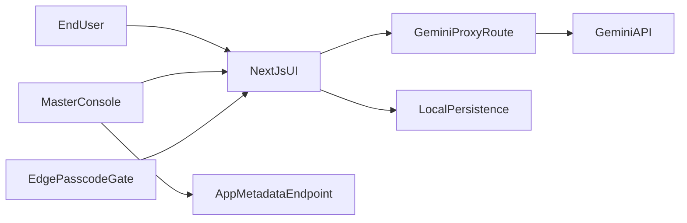

# Refactor Plan for Vercel-Ready Independent App

## Current State Snapshot
- App is a single HTML prototype: [architect v1.2.html](architect%20v1.2.html).
- Gemini calls happen directly in the browser with user-entered key.
- No persistence, no auth, no build tooling, and no reusable hook structure yet.

## Target Architecture (Default Choices)
- **Framework:** Next.js (App Router) + TypeScript, deployed on Vercel.
- **Independence:** App runs fully standalone (own routes, own auth gate, own persistence import/export).
- **Umbrella-ready integration:** Expose a small, stable integration surface (`app metadata`, `health route`, optional host config endpoint) so master console can link/embed with minimal coupling.
- **Gemini security:** Server-side route handler uses `GEMINI_API_KEY` from Vercel env vars; frontend never sees secret.
- **Access control (free/simple):** Edge middleware passcode gate with secure cookie session and env-managed passcode.

## Workstreams

### 1) Project foundation + deployability
- Convert [architect v1.2.html](architect%20v1.2.html) into a structured Next.js app (`app`, `components`, `lib`, `hooks`, `types`).
- Add strict TypeScript config and linting baseline.
- Add Vercel-ready scripts/config and env templates (`.env.example` with `GEMINI_API_KEY`, `APP_ACCESS_PASSCODE`, `SESSION_SECRET`).
- Add a migration map so each existing step becomes a typed React component module.

### 2) Secure Gemini boundary
- Implement server route (`/api/gemini`) that accepts validated payloads and calls Gemini using server env var.
- Add request/response schema validation and typed error mapping.
- Centralize AI prompts in a typed prompt catalog to keep behavior consistent and easier to share with umbrella apps later.
- Replace direct client fetch-to-Gemini with client fetch-to-internal API only.

### 3) DRY reusable data hooks
- Introduce reusable hooks:
  - `useProfile` (session/profile metadata, app identity)
  - `useResources` (shared fetch/mutate wrapper with loading/error states)
  - `useProjectState` (typed multi-step state orchestration)
- Keep hooks framework-agnostic where possible (`lib/core`) so umbrella can reuse logic without UI lock-in.

### 4) Persistence + import/export
- Add local persistence layer (`localStorage` versioned schema) with autosave.
- Add explicit export/import for:
  - **JSON** (full fidelity restore)
  - **Markdown** (human-readable report/export)
- Add “session recovery” UX on load (restore previous session, start fresh, or import file).

### 5) Access security (simple/free)
- Implement middleware passcode gate:
  - Access page accepts passcode.
  - On success, sets signed/secure cookie.
  - Middleware protects all app routes except access + static assets.
- Add rate limiting guardrails at route level (lightweight best-effort using headers/window checks).
- Document tradeoff: shared-passcode is simple and free but not per-user identity.

### 6) UI/UX modernization (minor but high-impact)
- Replace prototype visual style with enterprise-ready design system primitives:
  - semantic color tokens, spacing scale, typography hierarchy, consistent card/button/feedback patterns.
- UX fluidity upgrades:
  - step completion indicators, prerequisite hints, persistent left-nav progress, sticky action bar.
  - inline non-blocking error states (replace `alert`), optimistic state transitions, clearer loading states.
- Refine copy tone to concise professional voice.
- Keep “modern enterprise” styling direction (clean, restrained, data-product feel; avoid generic AI-chat look).

### 7) Umbrella integration contract
- Add lightweight endpoints/config for host apps:
  - `/api/app-meta` (name, version, capabilities, route hints)
  - optional `postMessage` bridge for embedded mode (future-ready, toggled by config)
- Ensure app can run independently when umbrella is absent.
- Document integration recipe for master console (link-card + deep-link params + optional embed mode).

### 8) Validation and rollout
- Add Playwright E2E smoke tests (TypeScript) for:
  - passcode access,
  - core step flow,
  - API proxy success/error,
  - export/import recovery.
- Verify local + Vercel preview deploy.
- Provide rollout checklist and fallback plan.

## Proposed File Direction
- Existing source to decompose: [architect v1.2.html](architect%20v1.2.html)
- New key areas to introduce:
  - `app/page.tsx`, `app/layout.tsx`
  - `app/api/gemini/route.ts`
  - `middleware.ts`
  - `hooks/useResources.ts`, `hooks/useProfile.ts`, `hooks/useProjectState.ts`
  - `lib/gemini/client.ts`, `lib/prompts/*`, `lib/persistence/*`
  - `types/*`
  - `tests/e2e/*.spec.ts`

## Risks and Mitigations
- **Single-file migration risk:** Incremental step-by-step extraction with parity checks after each step.
- **Prompt behavior drift:** Snapshot prompt templates and compare representative outputs.
- **Security overconfidence:** Document shared-passcode limits; keep upgrade path to OAuth/Auth provider.
- **Data compatibility:** Version persisted schema and include migration handling for imports.